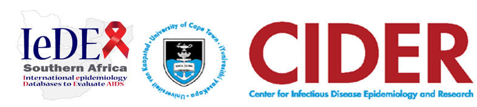

    
    

    <h1>Merge Compare (Cohort Data Quality Monitoring Application)</h1>

## Overview
The Merge Compare Application is a powerful tool developed using R Shiny to help data managers monitor and validate longitudinal cohort data. It is designed to link with an SQL Server data warehouse storing data in the IeDEA Data Exchange Standard (DES) format, enabling efficient tracking of data changes over time. This application focuses on providing insights into key cohort metrics such as enrolment age, enrolment trends, dropouts, mortality, viral load measurements, and ART regimen usage.

## Features
- **Data Connectivity**:

Direct connection to an SQL Server data warehouse containing IeDEA DES data.
- **Visual Comparisons**:

Compare metrics across different versions of cohort data.
- **Data Quality Assessment**:

Identify discrepancies, detect data tables that may not have been updated, and view key changes in metrics.
- **Interactive Dashboards**:

Use R Shiny to provide an interactive user experience for visualizing changes.
- **Focus Areas**:

1. Population age at enrolment
2. Enrolment trends over time
3. Dropout and mortality trends
4. Viral load and ART regimen trends
## Installation
To run the application, you will need to have R and RStudio installed on your computer. Follow these steps to set up the application:

**Clone the Repository**:

bash
Copy code
git clone https://github.com/IeDEA-SA/Merge_Compare.git 
- Install Required Packages:

The application depends on several R packages, including shiny, RODBC, dplyr, ggplot2, and others. You can install these packages using the following commands in R:

R
Copy code

install.packages(c("bslib","plotly","profvis","shiny","shinythemes", "readr","RODBC", "DT", "tidyverse","treemapify", "writexl","viridis"))

*Configure Database Connection*: 

Ensure that you have access to the SQL Server database storing the IeDEA DES data. Update the database connection details in the global.R file to match your server settings.

*Run the Application*: 

You can run the Shiny application by opening the app.R file in RStudio and clicking "Run App," or by using the following command in your R console:

R
Copy code
shiny::runApp("path/to/your/app")
Usage
The application provides the following workflow:

*Database Connection*: Connect to the SQL Server environment storing the cohort data.
*Data Import*: Load the cohort datasets that need to be compared.
*Data Quality Analysis*: Use the visual tools provided to compare different versions of data and identify any inconsistencies or changes.
*Insights*: Generate visualizations for enrolment trends, age demographics, dropout and mortality rates, ART regimens, and viral loads.
*Example Use Case*
*Enrolment Trends Over Time*: The application helps identify whether there have been significant changes in enrolment numbers across years and highlights possible discrepancies in data between updates.
*Viral Load Monitoring*: Visualize the distribution and changes in viral load levels across different versions of the dataset, ensuring data consistency.
*Mortality Analysis*: Track any changes in mortality data to understand trends or discrepancies that may arise from differences in data updates.
Contributing
If you would like to contribute to the project, feel free to submit a pull request or open an issue on GitHub. Contributions can include feature enhancements, bug fixes, or documentation improvements.

## Feedback and Support
If you have questions or need assistance, please contact the maintainer via GitHub or submit an issue. We value feedback from data managers and researchers and welcome suggestions for new features or improvements.

## License
This project is licensed under the MIT License. See the LICENSE file for more details.

## Acknowledgments
Developed as part of the IeDEA Southern Africa initiative.
Special thanks to the Data Harmonization group for their insights and collaboration in the development of this tool.
